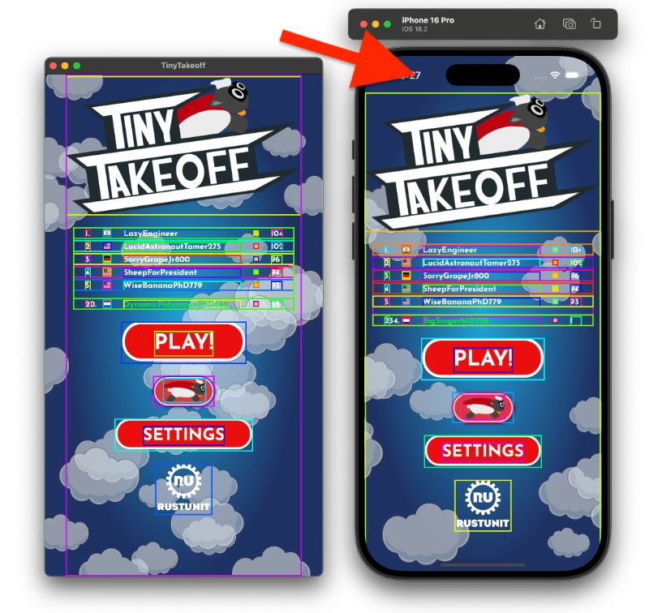

# bevy_ios_safearea

[](https://bevyengine.org/learn/quick-start/plugin-development/#main-branch-tracking)
[](https://crates.io/crates/bevy_ios_safearea)
[](https://docs.rs/bevy_ios_safearea)
[![discord][sh_discord]][lk_discord]

[sh_discord]: https://img.shields.io/discord/1176858176897953872?label=discord&color=5561E6
[lk_discord]: https://discord.gg/rQNeEnMhus

Bevy plugin to query ios device safe area insets.



## Features

* reads safe area on app start
* easy access via a resource
* noop on non-ios platforms (no `cfg`s needed in your app code)

## Instructions

1. Add to XCode: Add SPM (Swift Package Manager) dependency
2. Add Rust dependency
3. Setup Plugin

### 1. Add to XCode

* Go to `File` -> `Add Package Dependencies` and paste `https://github.com/rustunit/bevy_ios_safearea.git` into the search bar on the top right:
  

### 2. Add Rust dependency

```sh
cargo add bevy_ios_safearea
```

or

```toml
# always pin to the same exact version you also of the Swift package
bevy_ios_safearea = { version = "=0.5.0" }
```

### 3. Setup Plugin in Bevy

Initialize Bevy Plugin:

```rust
// request initialisation right on startup
use bevy::prelude::*;
App::new()
    .add_plugins((DefaultPlugins,bevy_ios_safearea::IosSafeAreaPlugin));
```

Accessing it:

```rust
use bevy::prelude::*;
use bevy_ios_safearea::IosSafeArea;

fn bevy_system(safe_area: IosSafeArea) {
    let safe_area_top = safe_area.top();
}
```

## Our Other Crates

- [bevy_debug_log](https://github.com/rustunit/bevy_debug_log)
- [bevy_device_lang](https://github.com/rustunit/bevy_device_lang)
- [bevy_web_popups](https://github.com/rustunit/bevy_web_popups)
- [bevy_libgdx_atlas](https://github.com/rustunit/bevy_libgdx_atlas)
- [bevy_ios_iap](https://github.com/rustunit/bevy_ios_iap)
- [bevy_ios_review](https://github.com/rustunit/bevy_ios_review)
- [bevy_ios_gamecenter](https://github.com/rustunit/bevy_ios_gamecenter)
- [bevy_ios_alerts](https://github.com/rustunit/bevy_ios_alerts)
- [bevy_ios_notifications](https://github.com/rustunit/bevy_ios_notifications)
- [bevy_ios_impact](https://github.com/rustunit/bevy_ios_impact)

## Bevy version support

|bevy|crate|
|----|---|
|0.18|0.5,main|
|0.17|0.4|
|0.16|0.3|
|0.15|0.1,0.2|

# License

All code in this repository is dual-licensed under either:

- MIT License (LICENSE-MIT or <http://opensource.org/licenses/MIT>)
- Apache License, Version 2.0 (LICENSE-APACHE or <http://www.apache.org/licenses/LICENSE-2.0>)

at your option. This means you can select the license you prefer.

## Your contributions

Unless you explicitly state otherwise, any contribution intentionally submitted for inclusion in the work by you, as defined in the Apache-2.0 license, shall be dual licensed as above, without any additional terms or conditions.
